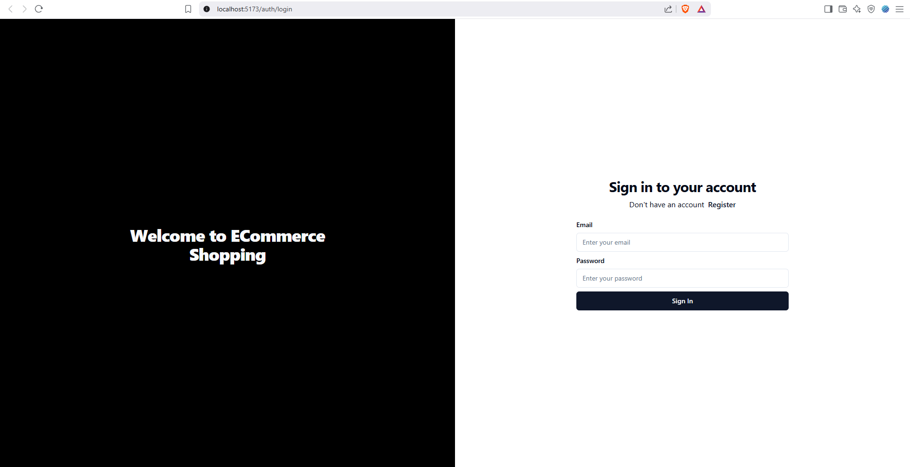

# E-ComExpress

## Overview

E-ComExpress is a full-stack e-commerce web application designed to provide users with a seamless online shopping experience. Built using the MERN (MongoDB, Express.js, React, Node.js) stack, the application offers a responsive and user-friendly interface for browsing and purchasing products.

## Features

- **User Authentication**: Secure user registration, login, and profile management.
- **Product Catalog**: Browse a wide range of products with detailed descriptions and images.
- **Shopping Cart**: Add products to the cart and manage quantities before checkout.
- **Order Management**: Place orders and view order history.
- **Admin Dashboard**: Manage products, orders, and users with administrative privileges.

## Screenshots




## Installation

To run this project locally, follow these steps:

1. **Clone the repository**:

   ```bash
   git clone https://github.com/chetangosavi/E-ComExpress.git

2. **Navigate to the project directory:

   ```bash
   cd E-ComExpress


3. **Install dependencies for the backend:

   ```bash
   cd server
   npm install

   
4. **Install dependencies for the frontend:

   ```bash
   cd ../client
   npm install

   
5. **Set up environment variables:
   - **Create a .env file in the Backend directory.
   - **Add the necessary environment variables (e.g., database connection strings, secret keys).

6. **Start the backend server:

      ```bash
      cd ../server
      npm run dev


7. **Start the frontend application:

      ```bash
      cd ../client
      npm run dev


8. **The application should now be running locally.

9. **Usage
- User Registration/Login: Create a new account or log in with existing credentials.
- Browse Products: Explore the product catalog and view detailed information.
- Manage Cart: Add or remove products from the shopping cart and adjust quantities.
- Checkout: Proceed to checkout to place orders securely.
- Admin Functions: (For admin users) Add, edit, or remove products; manage user roles; view and process orders.
